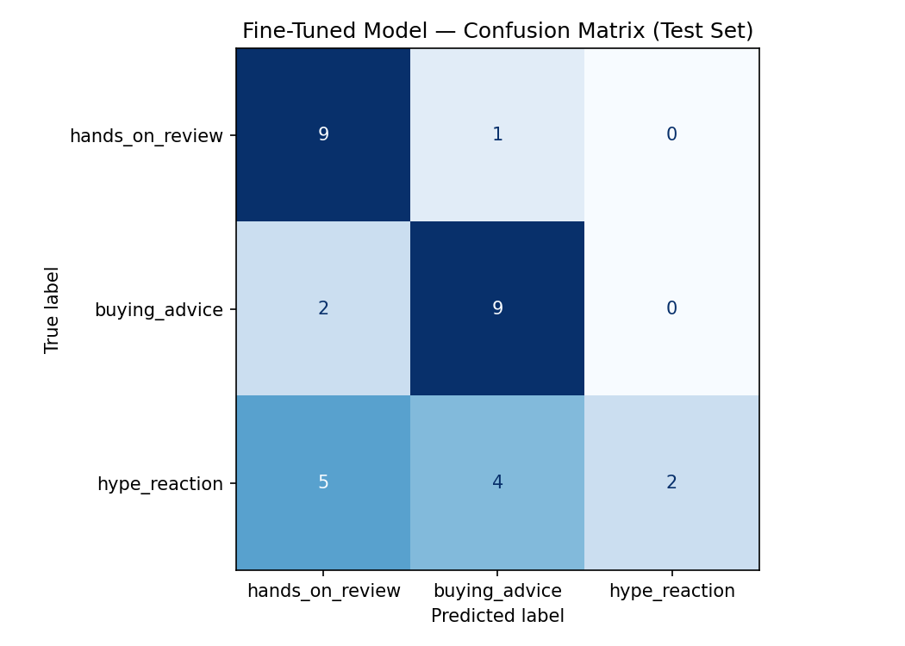

# TakeMeter: Tech Product Discussion Classifier

## Project Overview

TakeMeter is a fine-tuned text classifier that labels public tech product discussion comments by the type of contribution they make.

For this project, I focused on public tech product discussions about laptops, monitors, smartphones, keyboards, headphones, chargers, and PC accessories. These communities often mix real product experience, buying advice, and quick reactions in the same thread. That makes the task useful because readers often want to know whether a comment is based on hands-on use, recommendation logic, or just a quick opinion.

The classifier assigns each comment to one of three labels:

- `hands_on_review`
- `buying_advice`
- `hype_reaction`

The goal is not to judge the person writing the comment. The goal is to classify what the comment is doing.

## Community Choice

I chose public tech product discussion communities because they are active, text-heavy, and full of different types of product opinions.

The dataset includes public comments from Reddit-style tech discussion threads about Framework laptops, MacBooks, monitors, laptops, smartphones, keyboards, headphones, chargers, robot vacuums, e-readers, and other tech-related products.

This community is a good fit for a classification task because people use these comments to make real buying decisions. A comment based on direct ownership experience is different from a comment giving buying advice, and both are different from a short hype reaction. These differences matter to people reading product discussions because not every opinion gives the same type of value.

## Label Taxonomy

I used three mutually exclusive labels.

### `hands_on_review`

A `hands_on_review` comment describes direct experience using a product. It may mention pros, cons, setup, quality, defects, comfort, performance, battery life, display quality, sound quality, or problems noticed after use.

Example 1:

> I have used this monitor for about two weeks. The colors are good after calibration, but the stand feels cheap and the IPS glow is noticeable in a dark room.

Example 2:

> I bought this keyboard last month. The switches feel smoother than I expected, but the stabilizers are still a little rattly out of the box.

### `buying_advice`

A `buying_advice` comment recommends what someone should buy, avoid, compare, or prioritize based on budget, use case, product features, specs, or personal needs.

Example 1:

> If you mostly code and do school work, get a 27 inch 1440p IPS monitor instead of a cheap VA panel because text clarity and viewing angles matter more.

Example 2:

> If battery life is your top priority, get the MacBook. If repairability and Linux support matter more, get the Framework.

### `hype_reaction`

A `hype_reaction` comment mainly expresses excitement, disappointment, price shock, brand loyalty, quick praise, quick criticism, or a simple opinion without much detail.

Example 1:

> 240Hz at this price is actually insane.

Example 2:

> That laptop is overpriced garbage.

## Edge Case Rules

Some comments were difficult because they could fit more than one label. I used decision rules to keep the labels consistent.

### Review vs. Advice

A comment can include both personal experience and a recommendation.

Example:

> I have this monitor and it looks great after calibration, so I would buy it if you can get it under $180.

Decision rule: if the main purpose is describing direct product experience, I label it `hands_on_review`. If the main purpose is telling someone what to buy or avoid, I label it `buying_advice`.

Final decision: `buying_advice`, because the comment ends with a direct recommendation.

### Hype vs. Buying Advice

A short comment can sound like advice but have no real reasoning.

Example:

> This deal is crazy. Buy it before it sells out.

Decision rule: if the comment says to buy something but gives no reason, I label it `hype_reaction`. If it gives a reason based on price, specs, use case, or quality, I label it `buying_advice`.

Final decision: `hype_reaction`.

### Review vs. Hype Reaction

A comment can mention ownership but still lack useful review detail.

Example:

> I got this yesterday and it is amazing.

Decision rule: a comment must include at least one specific product detail to count as `hands_on_review`. If it only gives a broad opinion, I label it `hype_reaction`.

Final decision: `hype_reaction`.

## Dataset

The dataset contains 210 labeled public comments.

The examples were collected from public tech product discussion threads. I removed usernames and did not include private messages, profile information, or content behind authentication.

The CSV file is stored at:

```text
data/takemeter_dataset.csv
```

The CSV contains these columns:

```text
text,label,notes,source
```

## Label Distribution

| Label             |   Count |
| ----------------- | ------: |
| `hands_on_review` |      70 |
| `buying_advice`   |      70 |
| `hype_reaction`   |      70 |
| **Total**         | **210** |

I intentionally kept the dataset balanced so the model would not learn to predict one majority label. Each label represents exactly one third of the dataset.

## Labeling Process

I labeled each comment by reading the text and asking what the main purpose of the comment was.

The rules were:

1. If the comment mainly described direct product use, I labeled it `hands_on_review`.
2. If the comment mainly helped another person decide what to buy or avoid, I labeled it `buying_advice`.
3. If the comment mainly reacted with excitement, disappointment, quick praise, quick criticism, or price shock, I labeled it `hype_reaction`.

I did not use an `other` label. If a comment did not fit the taxonomy clearly, I skipped it instead of forcing it into the dataset.

I used AI assistance to help clean and pre-label batches of comments, but I reviewed the labels and kept the final decisions aligned with my label definitions.

## Difficult Labeling Examples

### Difficult Example 1

Comment:

> I have this monitor and it looks great after calibration, so I would buy it if you can get it under $180.

Possible labels:

- `hands_on_review`
- `buying_advice`

Final label:

- `buying_advice`

Why:

The first part describes product experience, but the main point of the comment is a buying recommendation. The phrase "I would buy it" makes the comment function as advice.

### Difficult Example 2

Comment:

> This deal is crazy. Buy it before it sells out.

Possible labels:

- `buying_advice`
- `hype_reaction`

Final label:

- `hype_reaction`

Why:

The comment tells someone to buy the product, but it does not explain why. It is mostly urgency and excitement, so I treated it as hype rather than real advice.

### Difficult Example 3

Comment:

> I got this yesterday and it is amazing.

Possible labels:

- `hands_on_review`
- `hype_reaction`

Final label:

- `hype_reaction`

Why:

The comment mentions ownership, but it does not include a specific detail about the product. Since it only gives a broad positive reaction, I labeled it as `hype_reaction`.

## Model and Training Approach

I fine-tuned `distilbert-base-uncased` using the Hugging Face `transformers` library in Google Colab.

The notebook handled:

- loading the labeled CSV
- mapping string labels to numeric labels
- splitting the dataset into train, validation, and test sets
- tokenizing the comments
- fine-tuning DistilBERT
- evaluating on the held-out test set
- generating a confusion matrix
- exporting `evaluation_results.json`

The dataset was split automatically into:

- 70 percent training
- 15 percent validation
- 15 percent test

The final test set contained 32 examples.

### Key Hyperparameters

| Hyperparameter |                     Value |
| -------------- | ------------------------: |
| Base model     | `distilbert-base-uncased` |
| Epochs         |                         3 |
| Learning rate  |                      2e-5 |
| Batch size     |                        16 |
| Weight decay   |                      0.01 |

I used 3 epochs because the dataset is small. More epochs could make the model memorize the examples instead of learning a more general distinction between review, advice, and hype.

## Baseline Model

For the baseline, I used Groq with `llama-3.3-70b-versatile` as a zero-shot classifier.

The baseline used the same test set as the fine-tuned model. I gave the model the label definitions, one example per label, and decision rules. The prompt required the model to return only one valid label name.

Valid labels were:

```text
hands_on_review
buying_advice
hype_reaction
```

This baseline was useful because it showed how well a strong general model could do without task-specific fine-tuning.

## Evaluation Results

I evaluated both models on the same held-out test set of 32 examples.

| Model                   | Accuracy |
| ----------------------- | -------: |
| Groq zero-shot baseline |   59.38% |
| Fine-tuned DistilBERT   |   62.50% |

The fine-tuned model improved over the Groq baseline by 3.12 percentage points.

This is a modest improvement, but it still shows that task-specific training helped. The task is subjective because some comments mix direct product experience, recommendation language, and emotional reaction in the same sentence.

The full metrics are saved in:

```text
results/evaluation_results.json
```

The confusion matrix image is saved in:

```text
results/confusion_matrix.png
```

## Fine-Tuned Model Per-Class Metrics

These values were calculated from the fine-tuned model confusion matrix.

| Label             | Precision | Recall |   F1 | Support |
| ----------------- | --------: | -----: | ---: | ------: |
| `hands_on_review` |      0.56 |   0.90 | 0.69 |      10 |
| `buying_advice`   |      0.64 |   0.82 | 0.72 |      11 |
| `hype_reaction`   |      1.00 |   0.18 | 0.31 |      11 |

The model performed best on `buying_advice` and `hands_on_review`. It struggled most with `hype_reaction`. The precision for `hype_reaction` was high because when the model predicted that label, it was usually right. However, the recall was low because the model missed many true hype reactions and predicted them as either reviews or advice.

## Confusion Matrix

Rows are true labels. Columns are predicted labels.

| True Label / Predicted Label | `hands_on_review` | `buying_advice` | `hype_reaction` |
| ---------------------------- | ----------------: | --------------: | --------------: |
| `hands_on_review`            |                 9 |               1 |               0 |
| `buying_advice`              |                 2 |               9 |               0 |
| `hype_reaction`              |                 5 |               4 |               2 |



## Error Analysis

The confusion matrix shows three main failure patterns.

### Error Pattern 1: Hype reactions were often predicted as hands-on reviews

The largest error pattern was true `hype_reaction` comments being predicted as `hands_on_review`. This happened 5 times.

A representative example of this type of difficult case is:

> I just got the MSI 245F X24. Absolute banger, super worth.

This kind of comment mentions ownership, which can make it look like a review. However, it does not give specific details about display quality, setup, defects, or long-term use. The main purpose is quick excitement, so it belongs in `hype_reaction`.

The model likely focused on phrases like "I just got" and product names, then treated the comment as a review. To improve this, I would add more short ownership comments that are still labeled as hype.

### Error Pattern 2: Hype reactions were also confused with buying advice

True `hype_reaction` comments were predicted as `buying_advice` 4 times.

A representative example of this type of difficult case is:

> Wow ok, not even worth the price reduction for both.

This sounds related to value and price, so the model may read it as advice. However, the comment does not explain a buying decision or compare specific needs. It is mostly a quick reaction to price.

To improve this boundary, I would add more examples where a comment uses words like "worth it" or "not worth it" but still lacks enough reasoning to count as real buying advice.

### Error Pattern 3: Buying advice was sometimes predicted as hands-on review

True `buying_advice` comments were predicted as `hands_on_review` 2 times.

A representative example of this type of difficult case is:

> If battery life is your top priority, get the MacBook. If repairability and Linux support matter more, get the Framework.

This is clearly advice because it tells the reader what to choose based on priorities. However, comments like this often mention specific product features, and the model may connect those details with review-style language.

To improve this, I would collect more mixed comments where product details are used to support a recommendation, not to describe personal ownership.

## Sample Classifications

These examples show the type of output the classifier produces. The demo video shows the model running live with predicted labels and confidence values.

| Comment                                                                                   | Predicted Label   | Why it makes sense                                                     |
| ----------------------------------------------------------------------------------------- | ----------------- | ---------------------------------------------------------------------- |
| "I have used this monitor for two weeks. The colors are good, but the stand feels cheap." | `hands_on_review` | The comment describes direct experience with specific product details. |
| "If battery life is your top priority, get the MacBook instead of the Framework."         | `buying_advice`   | The comment recommends a product based on a user priority.             |
| "This price is actually insane."                                                          | `hype_reaction`   | The comment is mostly a quick emotional reaction to price.             |
| "The keyboard feels solid, but the speakers are weak."                                    | `hands_on_review` | The comment gives specific product experience.                         |
| "Avoid the cheaper model if you need more RAM later."                                     | `buying_advice`   | The comment gives a recommendation based on future needs.              |

## Reflection: What the Model Learned

The model learned some useful patterns in tech product comments. It appeared to pick up on words and structures connected to ownership, recommendations, and emotional reactions.

For example, comments with phrases like "I bought," "I have used," or specific product details often fit `hands_on_review`. Comments with advice words like "get," "avoid," "choose," or "if you need" often fit `buying_advice`. Short emotional comments with words like "insane," "garbage," "amazing," or "not worth it" often fit `hype_reaction`.

However, the model did not fully learn the deeper idea behind the labels. The labels are based on the purpose of the comment, not just keywords. A comment can say "I bought this" and still be mostly hype if it gives no real detail. A comment can include excitement and still be buying advice if it gives a clear reason. This is where the model can still fail.

The model likely learned surface patterns more than human-level discourse intent. That makes sense because the dataset had only 210 examples.

## Reflection: What I Intended vs. What Happened

I intended the model to classify the main purpose of each comment:

- direct product experience
- buying recommendation
- quick reaction

In practice, the model probably learned a mix of purpose, wording, and product sentiment. This helped it beat the baseline slightly, but it also created failure cases. The hardest boundary was between `hands_on_review` and `buying_advice`, because many product comments include both personal experience and recommendations.

Another hard boundary was between weak buying advice and hype. A sentence like "buy it now" looks like advice, but without a reason it is closer to hype. That distinction is easy for a human to explain but harder for a small model to learn from a small dataset.

If I improved the project, I would collect more borderline examples and add more comments where the final label depends on the purpose of the comment rather than obvious keywords.

## Spec Reflection

The planning spec helped me because it forced me to define labels and edge cases before collecting the full dataset. That made the annotation process more consistent. Without that planning step, I probably would have labeled similar comments differently depending on how I felt in the moment.

One way the implementation diverged from the original plan was the data source mix. I initially planned to focus mostly on tech product communities such as monitor, PC building, laptop, keyboard, and headphone discussions. During data collection, I also included broader public tech-product recommendation threads because they still contained useful product comments and helped balance the labels. I kept the same label definitions, but I allowed the product categories to be broader so the classifier would learn discourse type instead of only learning one product community.

## AI Usage

I used AI assistance in several specific ways.

### 1. Label stress-testing

I used AI to test whether my labels were clear enough before labeling the full dataset. I asked it to generate borderline examples between `hands_on_review`, `buying_advice`, and `hype_reaction`. This helped me notice that comments saying "buy it" without a reason should not automatically count as buying advice. I revised my decision rule so unsupported "buy it now" comments became `hype_reaction`.

### 2. Annotation assistance

I used AI to help clean and pre-label batches of public comments. The AI suggested labels, but I reviewed the labels using my planning document rules. I corrected labels when the comment’s main purpose did not match the suggested category. I also skipped comments that were too short, deleted, off-topic, private, or not useful for the dataset.

### 3. Failure analysis support

I used AI to help think through error patterns after evaluation. I compared those suggestions with the actual confusion matrix and kept only the patterns that made sense for this task. The main pattern was that comments mixing personal experience, recommendations, and short emotional reactions were difficult because they sat near the label boundaries.

## Repository Structure

```text
ai201-project3-takemeter/
├── README.md
├── planning.md
├── data/
│   └── takemeter_dataset.csv
├── results/
│   ├── evaluation_results.json
│   └── confusion_matrix.png
├── notebooks/
│   └── takemeter_training.ipynb
└── prompts/
    └── groq_baseline_prompt.md
```

## How to Run

1. Open the training notebook in Google Colab.

```text
notebooks/takemeter_training.ipynb
```

2. Set the runtime to T4 GPU.

```text
Runtime > Change runtime type > T4 GPU
```

3. Upload the dataset.

```text
data/takemeter_dataset.csv
```

4. Run the notebook cells in order.

The notebook will:

- load the dataset
- split the data into train, validation, and test sets
- run the Groq zero-shot baseline
- fine-tune DistilBERT
- evaluate the fine-tuned model
- export `evaluation_results.json`
- export `confusion_matrix.png`

## Output Files

The main output files are:

```text
results/evaluation_results.json
results/confusion_matrix.png
```

`evaluation_results.json` stores the baseline accuracy, fine-tuned model accuracy, improvement, test set size, label map, and model name.

`confusion_matrix.png` visualizes the fine-tuned model mistakes on the test set.

## Demo Video

The demo video shows:

- 3 to 5 comments being classified
- predicted labels and confidence values
- one correct prediction and why it makes sense
- one incorrect prediction and why it failed
- a short walkthrough of the evaluation results
